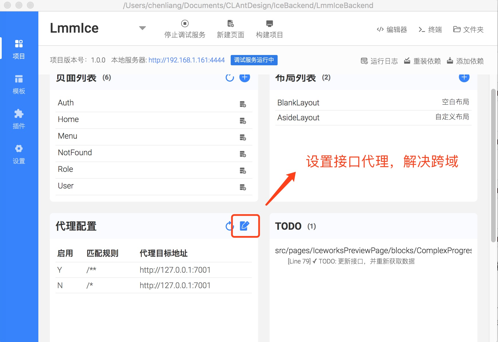
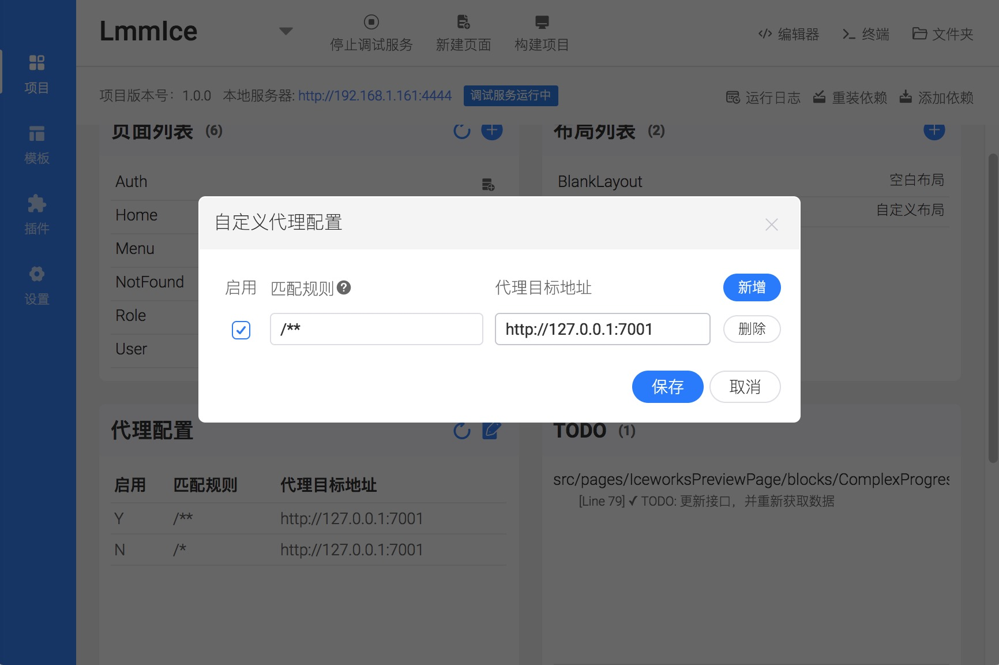
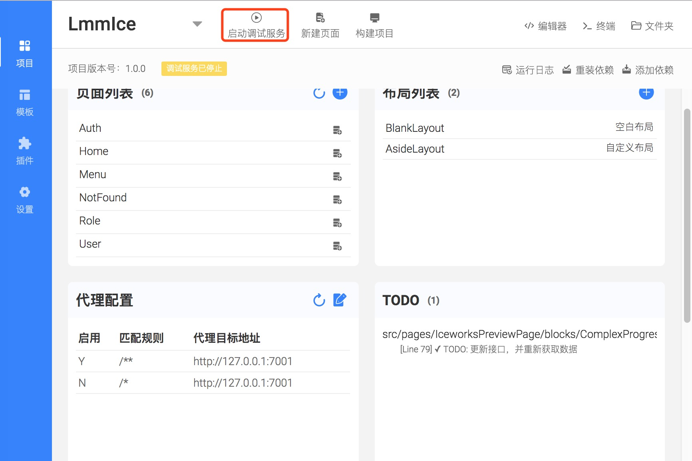

# 基于Ice（飞冰）工具搭建的后台权限管理

## 介绍

系统后台使用[egg](https://eggjs.org/)框架，并利用Graphql来做接口层. 利用[apollo](https://www.apollographql.com/docs/react/)搭建server端，与前端。

## 项目截图


## 项目启动

### mysql数据库导入

使用 NewLmmFrame.sql 生成数据库相关数据

### 后端接口启动

* 进入到eggserver目录下
* 使用vscode打开eggserver工程

* 修改mysql数据库配置，打开config.default.js 文件

* 修改配置

```
  config.mysql = {
    // 单数据库信息配置
    client: {
      // host
      host: '127.0.0.1',
      // 端口号
      port: '3306',
      // 用户名
      user: 'root',
      // 密码
      password: '11111',
      // 数据库名
      database: 'NewLmmFrame',
    },
    // 是否加载到 app 上，默认开启
    app: true,
    // 是否加载到 agent 上，默认关闭
    agent: false,
  };

```

* 安装依赖

```
npm install 
```

* 开发环境启动

```
npm run dev
```

* 部署环境启动

```
npm start
```

* 部署环境停止

```
npm stop
```

### 前端开发（前端工程目录是IceBackend）

* [下载飞冰工具](https://alibaba.github.io/ice/iceworks)

> 飞冰工具用于打开工程，新增页面，启动调试模式，构建工程，安装依赖等相关操作。

* 进入到IceBackend目录下

* 使用飞冰工具打开工程（注意：飞冰工具不是代码编辑器，主要用于工程构建调试等操作，代码编辑请使用vscode等相关工具），配置接口代理，解决跨域问题（正式环境，把前端打包成静态文件，放在后台接口同域下，或者统一使用ngnix，进行转发）




* 启动前端工程



* 浏览器打开

[访问登录页](http://localhost:4444/#/login)


