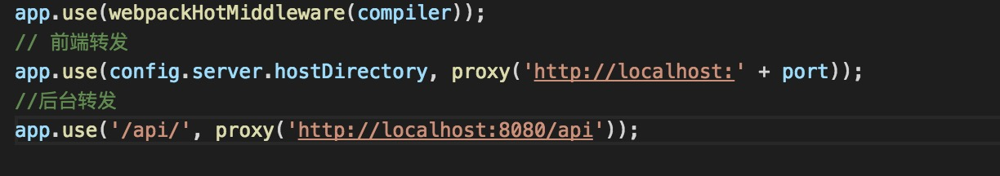
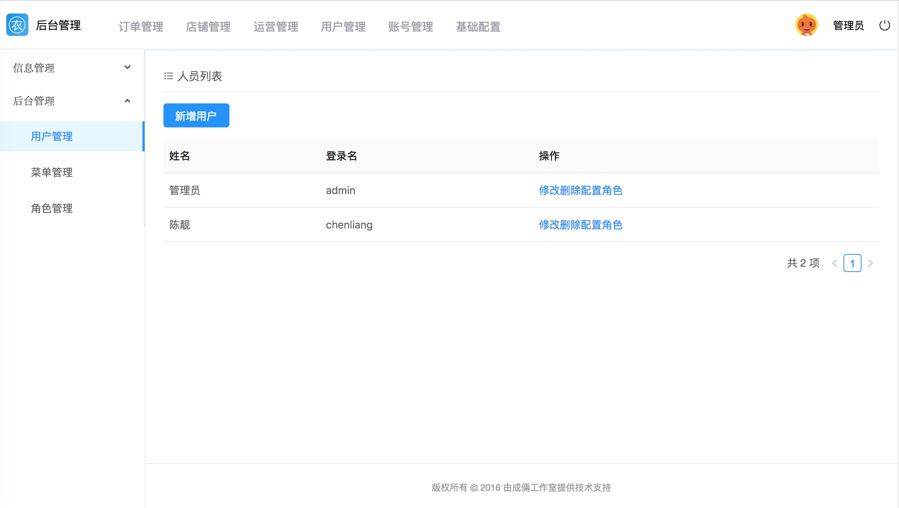
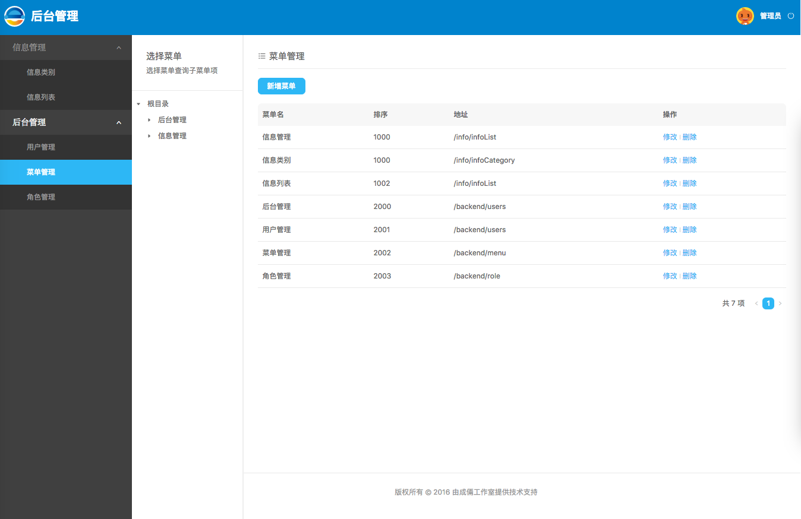

# CLReactAntDesign介绍
* CLReactAntDesign是基于[AntDesign2.0+](https://ant.design/)开发的后端页面例子，
* 整合react，react-router,react-redux，react-router-redux。进行页面状态控制
* 实用fetch进行页面请求，最终生成静态页面，实现前后端完全分离
* 附带使用koa实现的后端接口

# 目录介绍
* ReactBackEnd:基于AntDesign使用的后端SPA。
* server:后端koa搭建的服务接口，主要包括，菜单管理，角色管理，用户管理，信息发布。使用前，调整mysql数据库。使用clantd.sql修改数据库。
* VuxApp：后续会开发的基于Vux开发的移动webapp

#工程运行
进入到ReactBackEnd目录，编译运行前端框架

##安装

安装node依赖

```
npm install

```

##开发环境

开发使用webpack进行编译，并使用webpack.server启动一个服务器，进行页面的访问，

使用前，配置webpack.server，修改接口的转发。主要是调整端口



如上图，

前端转发，即今天服务器地址，默认端口port是9000，所以请求页面的默认地址是localhost:9000/index.html或localhost:9000

后端转发，为接口转发的时候，映射的地址。根据server工程设置的端口定，默认有两个，一个是请求常用接口，一个是登录验证。可视情况做相应调整

启动

```
npm run dev

```

##生产环境

```
npm run pub

```

执行上述命令，会生成相应的文件到根目录下的pub文件夹，直接放服务器中使用即可。

生产环境，建议使用ngnix部署，直接配置静态文件目录，放目录下，使用ngnix进行接口转发。解决跨域问题。

#后端工程启动

后端工程主要提供了一些基础的接口。使用koa来开发。整合token机制。


##安装

使用clantd.sql进行数据库的安装，

进入到server文件夹下，

###修改数据库配置文件

修改serer/database/mysqlUtil.js下的数据库配置文件

安装依赖
```
npm install

```

##启动

```
npm start
```


#展示
访问地址 localhost:9000 登录用户名密码，admin/123





